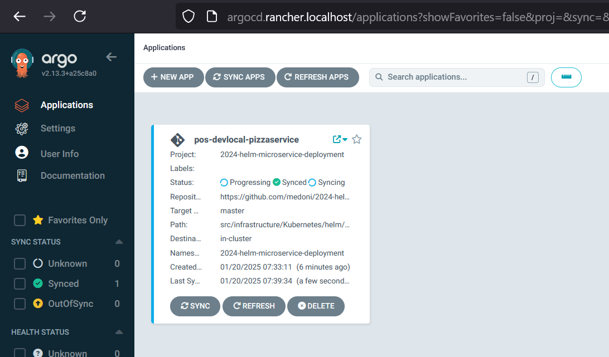
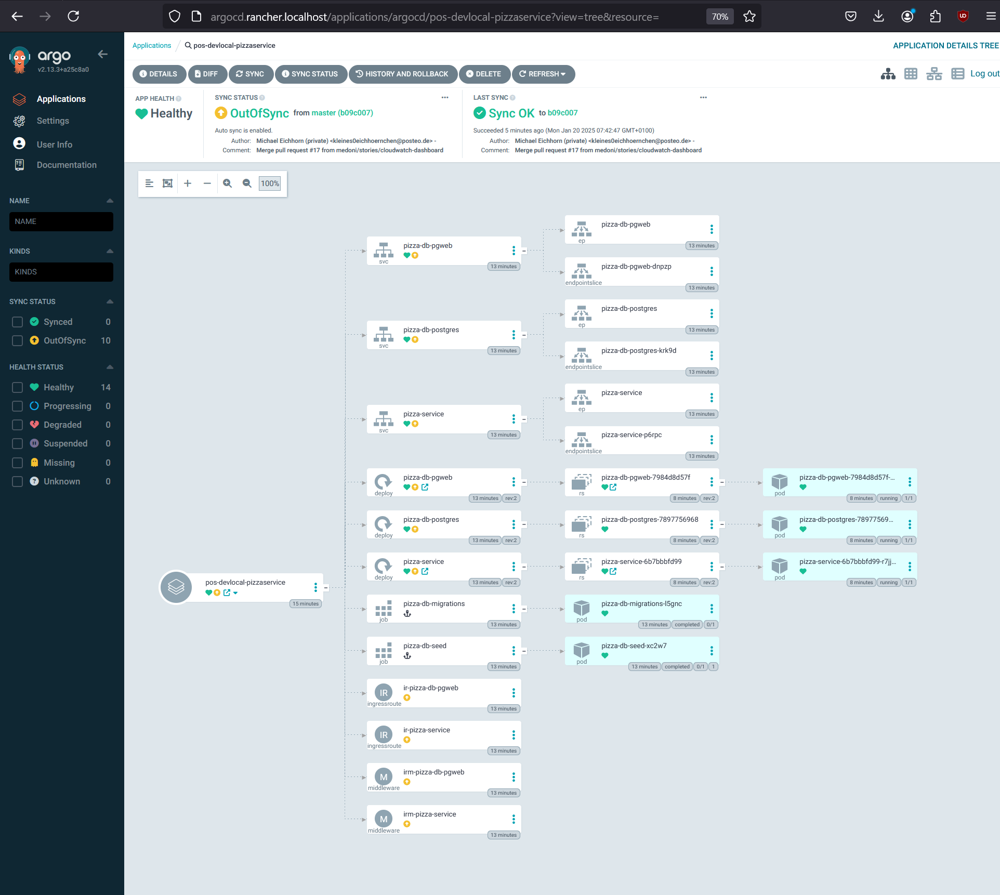

:::note Note
Before you start this section, it would be good to have a basic understanding 🦄...

- kubectl
- helm
- docker
- ArgoCD

:::

This section describes how to build 🦄...

Lorem ipsum dolor sit amet, consetetur sadipscing elitr, sed diam nonumy eirmod tempor invidunt ut labore et dolore magna aliquyam erat, sed diam voluptua. At vero eos et accusam et justo duo dolores et ea rebum. Stet clita kasd gubergren, no sea takimata sanctus est Lorem ipsum dolor sit amet. Lorem ipsum dolor sit amet, consetetur sadipscing elitr, sed diam nonumy eirmod tempor invidunt ut labore et dolore magna aliquyam erat, sed diam voluptua. At vero eos et accusam et justo duo dolores et ea rebum. Stet clita kasd gubergren, no sea takimata sanctus est Lorem ipsum dolor sit amet.

## Deployment host


1. Create a new Namespace in Kubernetes
   In this example, `2024-helm-microservice-deployment` is used as Kubernetes namespace. This can be individual be changed.
   ```bash
   $ kubectl create namespace 2024-helm-microservice-deployment
   ```

2. Create necessary secrets in Kubernetes
   ```bash
   $ kubectl create secret generic postgres-db-secrets \
       --save-config \
       --dry-run=client \
       --from-literal=username="<POSTGRES-USERNAME>" \
       --from-literal=password="<POSTGRES-PASSWORD>" \
       -n <K8S-NAMESPACE> \
       -o yaml \
       | kubectl apply -f -
   ```

   - `<POSTGRES-USERNAME>`: The username for Postgres. Used for accessing Postgres from the backend service and `pgweb` 
   - `<POSTGRES-PASSWORD>`: The password for Postgres
   - `<K8S-NAMESPACE>`: Namespace of your deployment.

   You can verify your this secrets with:
   ```bash
   $ kubectl -n <K8S-NAMESPACE> describe secrets postgres-db-secrets   
   # Name:         postgres-db-secrets
   # Namespace:    2024-helm-microservice-deployment
   # Labels:       <none>
   # Annotations:  <none>
   # 
   # Type:  Opaque
   # 
   # Data
   # ====
   # password:  5 bytes
   # username:  8 bytes
   ```

3. Register Project and Application in ArgoCD
    
  - Create Project in ArgoCD:
    ```bash
    $ kubectl apply -f src/infrastructure/Kubernetes/ArgoCD/argoproject.yaml
    ```
 
  - Create Application in ArgoCD:

    Open `src/infrastructure/Kubernetes/ArgoCD/argoapplication.yaml` and update namespace property in `.spec.destinations[0]`
    ```yaml
    spec:
        destinations:
        - namespace: <K8S-NAMESPACE>
            server: https://kubernetes.default.svc
    ```
    Register application
    ```bash
    $ kubectl apply -f src/infrastructure/Kubernetes/ArgoCD/argoapplication.yaml
    ```

    When opening ArgoCD you should see the your Application:

    

4. Build containers and push it to local Registry

    ```powershell
    $ ./src/build-and-deploy-dev-local.ps1 -kubeNamespace <K8S-NAMESPACE>
    ```

    After that, the application in ArgoCD should look like:

    

---

## Deployment CI/CD

Lorem 🦄 ipsum dolor sit amet, consetetur sadipscing elitr, sed diam nonumy eirmod tempor invidunt ut labore et dolore magna aliquyam erat, sed diam voluptua. At vero eos et accusam et justo duo dolores et ea rebum. Stet clita kasd gubergren, no sea takimata sanctus est Lorem ipsum dolor sit amet. Lorem ipsum dolor sit amet, consetetur sadipscing elitr, sed diam nonumy eirmod tempor invidunt ut 
labore et dolore magna aliquyam erat, sed diam voluptua. At vero eos et accusam et justo duo dolores et ea rebum. Stet clita kasd gubergren, no sea takimata sanctus est Lorem ipsum dolor sit amet.
